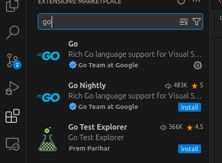

"Découvrez la puissance et la simplicité de Go, le langage de programmation conçu pour conquérir les défis du développement moderne avec efficacité et élégance."

# Introduction

### Démystifier Go : Exploration de l'Écosystème d'un Langage de Programmation Révolutionnaire

Dans le paysage des langages de programmation, émergent parfois des solutions qui résonnent avec la communauté des développeurs d'une manière unique. Go, souvent désigné sous le nom de Golang, est l'un de ces langages. Conçu par Google, Go a rapidement gagné en popularité pour sa simplicité, ses performances élevées et sa robustesse. Cependant, au-delà de ces caractéristiques techniques, Go possède un écosystème dynamique et en constante évolution qui mérite d'être exploré et compris.

Une des particularités les plus remarquables de Go est sa courbe d'apprentissage rapide. Grâce à sa syntaxe épurée et à une conception axée sur la simplicité et la lisibilité, les nouveaux développeurs peuvent se sentir rapidement à l'aise avec le langage. Cette facilité d'adoption ne compromet en rien la puissance de Go, bien au contraire : elle permet aux développeurs de se concentrer sur la résolution des problèmes plutôt que sur des subtilités syntaxiques.


Dans ce document, nous nous aventurerons dans l'univers de Go, explorant non seulement les fondements du langage lui-même, mais également l'écosystème qui l'entoure. Nous plongerons dans les bibliothèques standard, les outils de développement, les frameworks et les projets open source qui font de Go bien plus qu'un simple langage de programmation, mais plutôt une communauté vibrante et innovante.


Que vous soyez un développeur curieux cherchant à en apprendre davantage sur Go, un décideur évaluant les technologies pour votre prochain projet, ou simplement quelqu'un intéressé par les dernières avancées technologiques, ce document servira de guide pour naviguer à travers les méandres de Go et son écosystème florissant.


Préparez-vous à être éclairé, inspiré et peut-être même surpris par la richesse et la diversité de ce que Go et sa communauté ont à offrir.


# Installation


### Téléchargement de Go :

- Rendez-vous sur le site officiel de Go à l'adresse https://golang.org/dl/.
- Téléchargez la version appropriée pour votre système d'exploitation (Linux, macOS, Windows, etc.).
- Une fois le téléchargement terminé, extrayez l'archive dans le répertoire **$HOME/Community/go**.

### Configuration des variables d'environnement :

- Ouvrez ou créez le fichier de profil de votre shell (**~/.bash_profile**, **~/.bashrc**, **~/.zshrc**, etc.).
- Ajoutez les lignes suivantes pour définir les variables d'environnement **GOROOT**, **GOPATH**, et mettre les binaires de **GOPATH/bin** dans le **PATH** :

```bash
export GOROOT=$HOME/Community/go
export GOPATH=$HOME/Community/gopath
export PATH=$PATH:$GOROOT/bin:$GOPATH/bin
```


### Vérification de l'installation :

- Ouvrez un nouveau terminal.
- Tapez **go version** pour vérifier que Go est correctement installé et configuré.

```bash
elfeo@elfeo:~/Project/golang-demystified$ go version
go version go1.22.2 linux/amd64
```
Avec ces configurations, vous pourrez utiliser Go et ses outils associés de manière fluide, en ayant accès aux binaires des packages installés dans **$HOME/Community/gopath/bin**.


### Téléchargement de Visual Studio Code :

- Rendez-vous sur le site officiel de Visual Studio Code à l'adresse https://code.visualstudio.com/.
- Téléchargez la version appropriée pour votre système d'exploitation (Linux, macOS, Windows, etc.).
- Suivez les instructions pour installer Visual Studio Code sur votre système.


### Installation d'extensions pour Go :



- Recherchez "Go" dans la barre de recherche des extensions.
- Installez l'extension **"Go"** proposée par Microsoft, en cliquant sur le bouton **"Installer"**.


### Configuration de l'environnement Go :

- Ouvrez les paramètres de Visual Studio Code en appuyant sur Ctrl+, ou en sélectionnant **"Fichier" > "Préférences" > "Paramètres"**.
- Recherchez "go.gopath" dans la barre de recherche des paramètres.
- Spécifiez le chemin du répertoire gopath que vous avez configuré précédemment, par exemple **"$HOME/Community/gopath"**.
- Enregistrez les modifications.


### Vérification de l'installation :

- Redémarrez Visual Studio Code pour appliquer les paramètres.
- Créez un nouveau fichier Go ou ouvrez un projet existant.
- Visual Studio Code devrait automatiquement détecter que c'est un projet Go et proposer des suggestions d'installation d'outils supplémentaires si nécessaire.
- Vous êtes maintenant prêt à coder en Go avec Visual Studio Code !

Avec Visual Studio Code et l'extension Go, vous bénéficierez d'un environnement de développement puissant et convivial pour vos projets en Go.


# Exploration


### $GOROOT

Voici une explication rapide des répertoires principaux présents dans **$GOROOT**, qui est le répertoire où est installé Go :

- **bin/** : Ce répertoire contient les exécutables binaires de Go, y compris le binaire de l'interpréteur Go (go) et d'autres outils comme le formateur de code (gofmt), l'outil de gestion de modules (go mod), etc.

- **pkg/** : Ce répertoire contient les packages précompilés, c'est-à-dire les fichiers objets résultant de la compilation des fichiers source Go. Ces fichiers sont utilisés lors de la construction de programmes Go pour accélérer les temps de compilation.

- **src/** : Bien que souvent vide dans le répertoire **$GOROOT** standard, ce répertoire est destiné à contenir les fichiers source des packages standard de Go. Ces fichiers source sont généralement inclus dans le code source de Go lors de l'installation.

- **include/** : Ce répertoire contient les fichiers d'en-tête nécessaires pour la construction de programmes Go qui utilisent des paquets C, C++ ou autres langages compatibles avec Go. Ces fichiers d'en-tête sont utilisés par le compilateur Go lors de la liaison avec des bibliothèques externes.

- **misc/** : Ce répertoire contient diverses ressources et outils supplémentaires liés à Go, tels que des exemples de code, des scripts de test, etc. Ces ressources peuvent être utiles pour explorer et apprendre Go plus en profondeur.


Ces répertoires constituent l'infrastructure de base de l'installation de Go dans le répertoire **$GOROOT**, et chacun joue un rôle spécifique dans le fonctionnement et le développement avec Go.


### $GOPATH

Voici une explication rapide des répertoires principaux présents dans **$GOPATH**, qui est le répertoire où sont stockés les projets et les dépendances pour les applications Go :

- **bin/** : Ce répertoire contient les exécutables binaires des programmes Go que vous avez installés localement à l'aide de la commande **go install**. Les binaires installés ici sont généralement des outils Go tiers que vous utilisez dans votre workflow de développement.

- **pkg/** : Similaire au répertoire **pkg/** dans **$GOROOT**, ce répertoire contient les packages précompilés des projets Go que vous avez construits. Ces packages sont compilés à partir du code source des projets situés dans le répertoire **src/**.

- **src/** : C'est le répertoire principal où vous stockez le code source de vos projets Go. Chaque sous-répertoire de src/ correspond généralement à un chemin d'importation pour les packages Go. Par exemple, si votre projet est **github.com/utilisateur/monprojet**, vous créerez un répertoire **github.com/utilisateur/monprojet** dans **src/** et placerez votre code source là-dedans.

- **pkg/mod/** : À partir de Go 1.11, ce répertoire est utilisé pour stocker les modules Go téléchargés. Lorsque vous utilisez les modules Go pour gérer les dépendances de vos projets, les fichiers source et les dépendances téléchargées sont stockés ici pour une gestion efficace des dépendances.


- **bin/** (à l'intérieur de **$GOPATH/pkg/mod/**) : Ce sous-répertoire contient également des binaires, mais spécifiquement pour les modules Go téléchargés. Ces binaires sont souvent des outils associés à des modules particuliers que vous avez téléchargés et qui sont nécessaires pour la construction ou la gestion de projets Go.

Ces répertoires forment la structure de base de **$GOPATH** et sont utilisés pour stocker les projets, les dépendances et les binaires associés à votre environnement de développement Go.

# Commandes

Voici une explication rapide des commandes les plus couramment utilisées avec Go :

- **go mod init** : Initialise un nouveau module Go dans le répertoire courant. Un module est une collection de packages Go qui sont gérés ensemble, généralement stockés dans un référentiel versionné.


Supposons que vous souhaitez créer un nouveau module Go pour un projet appelé **"monprojet"**. Vous pouvez utiliser go mod init pour initialiser un nouveau module dans le répertoire de votre projet.

- Créez un nouveau répertoire pour votre projet et accédez-y dans votre terminal :

```bash
mkdir monprojet
cd monprojet
```


- Initialisez un nouveau module Go en utilisant go mod init avec le nom de votre module. Par exemple, si vous avez l'intention de publier votre code sous **github.com/utilisateur/monprojet**, vous pouvez utiliser :

```bash
go mod init github.com/utilisateur/monprojet
```


- Après avoir exécuté cette commande, un fichier **go.mod** sera créé dans le répertoire de votre projet. Ce fichier contient des informations sur votre module, y compris son chemin d'importation et les dépendances (initialisées à ce stade comme étant les dépendances standard de Go).


```go
module github.com/utilisateur/monprojet

go 1.22

require (
    github.com/pkg1 v1.2.3
    github.com/pkg2 v0.4.0
)

replace (
    github.com/pkg2 => github.com/utilisateur/pkg2 v0.4.1
)

```


- **module github.com/utilisateur/monprojet** : Cette ligne spécifie le chemin d'importation de votre module Go. Cela permet à d'autres programmes Go de référencer votre module en important ce chemin.

- **go 1.22** : Cette ligne spécifie la version minimale de Go requise pour construire votre projet.


- **require** : Cette section liste les dépendances de votre projet, avec leurs noms de module et leurs versions. Par exemple, **github.com/pkg1 v1.2.3** signifie que votre projet dépend de la version 1.2.3 du module github.com/pkg1.


- **replace** : Cette section permet de remplacer les dépendances par d'autres. Cela peut être utile pour utiliser des versions modifiées ou locales de dépendances. Par exemple, **github.com/pkg2 => github.com/utilisateur/pkg2 v0.4.1** remplace la dépendance github.com/pkg2 par github.com/utilisateur/pkg2 à la version v0.4.1.


- Vous pouvez maintenant commencer à développer votre projet en Go ! Vous pouvez ajouter des dépendances à l'aide de la commande **go get** et utiliser des packages externes sans crainte de perturber votre environnement de développement grâce à la gestion des modules.

Cet exemple illustre comment utiliser **go mod init** pour initialiser un nouveau module Go dans un projet et démarrer le développement avec la gestion des modules.


- **go mod tidy** : Analyse les dépendances de votre projet et met à jour le fichier go.mod et, le cas échéant, le fichier go.sum pour refléter les dépendances réellement utilisées par votre code. Il supprime également les dépendances qui ne sont plus nécessaires.


- **go mod vendor** : Copie les dépendances de votre projet dans le répertoire **vendor/** de votre projet. Cela permet de garantir que toutes les dépendances nécessaires sont présentes localement et que le code peut être construit et exécuté de manière isolée.


- **go run** : Compile et exécute immédiatement le fichier Go spécifié. Cela permet d'exécuter rapidement un programme Go sans avoir à le construire séparément.


- **go install** : Compile et installe le package ou le programme Go spécifié. Si le package ou le programme est un exécutable, il sera installé dans le répertoire **bin/** de votre **$GOPATH** ou de votre module.


- **go test** : Exécute les tests unitaires pour le package Go spécifié. Il recherche les fichiers **_test.go** dans le package et exécute les fonctions de test qu'ils contiennent.

Ces commandes constituent un ensemble de base pour gérer les dépendances, construire, exécuter et tester des programmes Go. Elles sont largement utilisées dans le développement quotidien avec Go.


